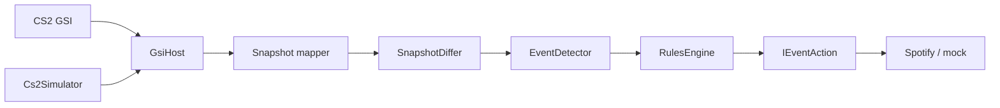

# UndefaultIt

[](https://github.com/AlexGud-HGGames/Undefault/actions/workflows/ci.yml)

**CS2 Game State Integration → event pipeline → Spotify playback control** — a local Windows backend in .NET 8.

UndefaultIt ducks or restores Spotify volume from live CS2 game state (e.g. `round_start` → duck, `death` → restore). It is local playback control, not a synchronized soundtrack.

## Highlights

- **Layered architecture** — `Core` (domain) / `GsiHost` (ASP.NET Minimal APIs) / `Cs2Simulator` (~185 `.cs` files)
- **Event pipeline** — snapshot diff → detector → rules engine → actions (config-driven, no YAML scenario engine)
- **Spotify OAuth2 (PKCE)** + Windows DPAPI-encrypted local credential store
- **Local CS2 simulator** with scripted scenarios — develop and test without launching the game
- **xUnit** — three test projects (`Core.Tests`, `GsiHost.Tests`, `Cs2Simulator.Tests`) + GitHub Actions CI on `windows-latest`

## Architecture



CS2 (or the simulator) posts JSON to the host. The host normalizes state, detects gameplay events, and runs configured actions against Spotify. Multi-title routing is already in place: CS2 is the full path; Dota 2 currently logs GSI events only (see below).

## Quick start (mock, ~2 min)

```powershell
# Terminal 1 — host with mock Spotify (no OAuth, no CS2 install)
dotnet run --project .\GsiHost -- --quick

# Terminal 2 — local CS2 GSI simulator
dotnet run --project .\Cs2Simulator
```

Then open `http://127.0.0.1:5292/status`. Watch the host console for `round_start` / `death` and mock Spotify volume calls.

Full runbook (real Spotify, flags, endpoints, config): **[docs/](docs/README.md)** · architecture detail: **[docs/backend-architecture.md](docs/backend-architecture.md)**

## Project layout

| Project | Role |
| --- | --- |
| `Core/` | Models, diffing, event detection, rules, Spotify abstractions |
| `GsiHost/` | HTTP host, GSI mapping, OAuth, CS2 setup, control profiles |
| `Cs2Simulator*` | Console + runtime + scenario packs that post realistic GSI payloads |
| `*.Tests/` | Unit and integration coverage |

## For game / Unity engineers

Built as a **production-style .NET service outside Unity**: layered architecture, DI, config-driven rules, OAuth, encrypted secrets, simulators, and automated tests. Same habits transfer to Unity work — MVVM/DI, data-driven systems, tooling for designers/QA, and CI.

**Multi-game direction (honest status):**

- **CS2** — primary path: GSI → rules → Spotify actions
- **Dota 2** — `POST /gsi/dota` logs game-state / death / pause transitions to the timeline today; a full adapter and Spotify wiring are planned next ([ingestion spec](docs/ingestion-spec-cs2-dota.md))
- **Unity asset (planned)** — a separate package so game projects can talk to the same local player/control surface without owning the Spotify/OAuth stack themselves (not shipped yet)

## Status & limits

- Windows-first (console bootstrap uses the encrypted Windows secret store)
- Real Spotify control needs Premium and an active playback device
- No desktop UI in this repo — console checklist + local HTTP API
- OAuth tokens are process-local (re-auth after restart)
- Safety-first music architecture is documented; runtime integration is still partial

## Docs

| Doc | Contents |
| --- | --- |
| [docs/README.md](docs/README.md) | Documentation index |
| [docs/quick-launch.md](docs/quick-launch.md) | Startup flags and failure handling |
| [docs/backend-architecture.md](docs/backend-architecture.md) | Full pipeline, HTTP endpoints, config |
| [docs/cs2-simulator.md](docs/cs2-simulator.md) | Simulator scenarios and CLI |
| [docs/manual-intent-timeline.md](docs/manual-intent-timeline.md) | Timeline / observe+record MVP mode |
| [docs/ingestion-spec-cs2-dota.md](docs/ingestion-spec-cs2-dota.md) | CS2 / Dota ingestion shape |
| [docs/roadmap.md](docs/roadmap.md) | Forward-looking work |

Agent/contributor constraints for Cursor live in [AGENTS.md](AGENTS.md), not here.

## License

See [LICENSE](LICENSE).
