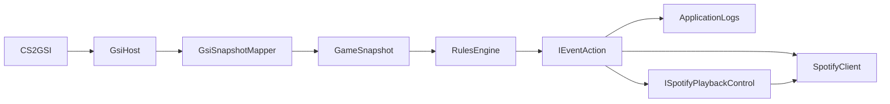

# Backend Architecture

## Purpose

This document describes the current backend shape of UndefaultIt as it exists today.

The active product path is console-first:

- `GsiHost` is the runtime entry point
- CS2 Game State Integration posts to the local backend
- real Spotify OAuth is supported and used in the normal console flow
- Spotify app credentials can be stored in an encrypted local Windows secret store
- the OAuth access token is still process-local and lives in memory
- the default gameplay automation is `round_start -> duck` and `death -> restore_volume`
- further behavior is expressed through `RulesEngine.ActionMap`, console control profiles, and optional legacy track profiles

## High-Level Solution Shape

| Project | Responsibility |
|---|---|
| `Core` | Domain models, event detection, rules, Spotify abstractions, playback helpers |
| `GsiHost` | ASP.NET Minimal API host, config persistence, CS2 setup, console bootstrap, JSON-backed profile files—the product entry point for real use |

The backend is intentionally layered so that gameplay ingestion, event normalization, routing, and playback remain distinct concerns.

Inside **`RulesEngine`**, each snapshot runs through **`SnapshotDiffer`** (vs the stored previous snapshot), then **`EventDetector`**, then **`RulesEngineOptions.ActionMap`** dispatches to **`IEventAction`** implementations.

## Startup Sequence

The runtime starts in `GsiHost/Program.cs`.

Startup order:

1. `WebApplication.CreateBuilder(args)`
2. `ConsoleLaunchBootstrap.Apply(builder, args)`
3. DI registration for mapping, detection, rules, actions, services, and Spotify
4. options binding from `appsettings.json`
5. host build
6. automatic CS2 setup via `EnsureCs2SetupAsync()`
7. Smart Track Start warm-up via `WarmSmartTrackStartAsync()`
8. Spotify authorization URL logging
9. console startup checklist output
10. endpoint mapping and `app.Run()`

This matters because the console bootstrap injects runtime overrides before most of the host is configured.

## Console Bootstrap And Secret Handling

`GsiHost/Services/ConsoleLaunchBootstrap.cs` is the console-first startup shim.

Its current responsibilities:

- normalize the GSI base URL
- normalize the Spotify redirect URI
- force `UseMockSpotify = false` for the console flow
- resolve Spotify client credentials from multiple sources
- support `--reset-spotify-secrets` and `--clear-spotify-secrets`
- persist app credentials in encrypted local storage on Windows
- apply config overrides in memory without mutating git-tracked files
- bind Kestrel to the chosen local URL with `builder.WebHost.UseUrls(...)`

Credential precedence is:

1. environment variables `CLIENT_ID` and `CLIENT_SECRET`
2. encrypted local secret store
3. `appsettings.json`
4. interactive console prompt if credentials are still missing or reset is requested

Current limitations:

- encrypted local secret storage is Windows-only
- access tokens are not persisted across process restarts
- the backend still depends on a real active Spotify playback device for playback control

## Configuration And File Model

The backend uses several distinct configuration surfaces rather than one large schema.

| File / surface | Role |
|---|---|
| `GsiHost/appsettings.json` | host runtime settings, detector options, action map, Spotify client options, Smart Track Start toggle |
| `GsiHost/control-profiles.json` | console-first music control rules like `pause`, `resume`, `duck`, `restore_volume` |
| `profiles.json` in host content root | legacy track-routing profiles mapping `eventKey -> Spotify URI[]` |
| `GsiHost/smart-track-starts.json` | optional Smart Track Start metadata keyed by Spotify track URI or track id |

Important nuance:

- `JsonControlProfileService` creates and writes a default `control-profiles.json` when the file is missing
- `JsonSmartTrackStartService` creates and writes an empty `smart-track-starts.json` when the file is missing
- `JsonProfileService` returns a default in-memory profile config when `profiles.json` is missing, but does not eagerly create the file on disk until something saves it

### `appsettings.json`

Current top-level sections:

- `Spotify`
- `Gsi`
- `UseMockSpotify`
- `EventDetector`
- `SpotifyVolumeDuck`
- `SmartTrackStart`
- `RulesEngine`

`AppSettingsConfigurationService` persists the editable system config surface for:

- Spotify client id
- Spotify redirect URI
- Spotify scopes
- GSI method/path/url
- `UseMockSpotify`

It intentionally preserves an existing `Spotify.ClientSecret` value in the JSON file rather than overwriting it from API input.

### Console Control Profiles

`Core/Configuration/ConsoleControlProfilesConfig.cs` defines the console control-profile model:

- `ConsoleControlProfilesConfig`
- `ConsoleControlProfile`
- `EventControlRule`

Supported commands are:

- `pause`
- `resume`
- `duck`
- `restore_volume`

`JsonControlProfileService` validates:

- non-empty profile ids and names
- unique profile ids
- unique event keys within each profile
- supported commands only
- `duck` volumes between `0` and `100`

Default file content:

- active profile `console-default`
- `round_start -> duck 0`
- `death -> restore_volume`

`SpotifyControlProfileAction` applies those commands through `ISpotifyPlaybackControl` (`SpotifyPlaybackControlCoordinator`) so duck, restore, pause, and resume stay consistent across events. The coordinator reads **`SpotifyVolumeDuckOptions`**: a `duck` rule without `VolumePercent` uses `MuteVolume` as the target, and `restore_volume` falls back to `FallbackRestoreVolume` when no pre-duck volume was saved.

### Legacy Track Profiles

`Core/Configuration/AppConfig.cs` defines the older track-routing model:

- `MusicProfilesConfig`
- `MusicProfile`
- `EventTrackRule`

This path is still available for URI-based playback scenarios and for future profile-driven track starts. It is not the default console flow right now.

### Smart Track Start Metadata

`Core/Configuration/SmartTrackStartsConfig.cs` defines the optional smart-start catalog:

- `SmartTrackStartsConfig`
- `SmartTrackStartEntry`

Each entry can match by:

- `TrackUri`
- `TrackId`

Each entry carries:

- `StartPositionMs`
- optional `CueLabel`

`SmartTrackStartOptions` currently exposes:

- `Enabled`
- `PreloadOnStartup`

## HTTP Surface

The backend is currently a Minimal API host with these main routes:

| Method | Path | Purpose |
|---|---|---|
| `GET` | `/` | short host identification string |
| `POST` | `/gsi` | receive CS2 GSI payloads |
| `POST` | `/gsi/reset` | reset detector, snapshot store, recent events, and timeline session |
| `GET` | `/status` | current app/runtime status |
| `GET` | `/events` | recent normalized events |
| `GET` | `/timeline` | recent unified timeline (GSI + manual actions) |
| `GET` | `/timeline/episodes` | manual-intent episodes with before/after windows |
| `POST` | `/user-actions` | record manual music intent; apply control-profile rule |
| `GET` | `/spotify/status` | Spotify auth/runtime diagnostics |
| `GET` | `/config` | read editable system config |
| `PUT` | `/config` | save editable system config |
| `GET` | `/control-profiles` | read console control profiles |
| `PUT` | `/control-profiles` | save console control profiles |
| `GET` | `/profiles` | read legacy track profiles |
| `PUT` | `/profiles` | save legacy track profiles |
| `GET` | `/setup/cs2/status` | read CS2 setup state |
| `POST` | `/setup/cs2/install` | install or update the CS2 GSI cfg |
| `GET` | `/spotify/authorize` | produce an authorization URL in real mode |
| `GET` | `/callback` | OAuth callback endpoint |
| `GET` | `/spotify/callback` | alternate OAuth callback endpoint |
| `GET` | `/diagnostics/music-shadow` | debug-only inspection of the Phase A music orchestration facade shadow output (UND-22) |

See [manual-intent-timeline.md](manual-intent-timeline.md) for timeline storage, configuration, and how manual actions relate to `RulesEngine.ActionMap`.

## GSI Ingestion Pipeline

The gameplay pipeline is deliberately small and linear:

1. CS2 posts JSON to `POST /gsi`
2. `GsiProcessingService` logs the first successful connection once
3. `GsiSnapshotMapper` converts the DTO payload into a `GameSnapshot`
4. `RulesEngine.EvaluateAsync` runs:
   - load the previous snapshot from `ISnapshotStore`
   - `SnapshotDiffer` compares previous and current snapshots
   - `EventDetector` emits zero or more normalized events from the diff
   - for each event, look up action keys in `RulesEngineOptions.ActionMap` and execute matching `IEventAction` instances in list order
   - persist the current snapshot in `ISnapshotStore`
5. the service returns the list of normalized events emitted in that evaluation (for the HTTP response shape)

## Snapshot Mapping

The host does not map the full CS2 GSI payload yet. It currently maps the subset needed for the existing detector and near-term control-profile automation.

Active module mappers:

- `VitalsModuleMapper`
- `PositionModuleMapper`
- `CombatModuleMapper`
- `RoundModuleMapper`

Current mapped runtime concepts:

- player health and armor
- coarse alive/dead state
- player position
- coarse combat hint from player activity
- map round number
- map phase

This narrow mapping is intentional and aligns with the project’s current CS2 event reference in [`cs2-gsi-events.md`](cs2-gsi-events.md).

## Event Detection

`Core/Rules/EventDetector.cs` is stateful and derives normalized events from snapshot diffs.

Currently supported normalized event families:

- `round_start`
- `death`
- `combat`
- `idle`

Default enabled behavior in `appsettings.json`:

- `round_start = enabled`
- `death = enabled`
- `combat = disabled`
- `idle = disabled`

You can add more keys under `EventDetector` to match **`EventDetectorOptions`** when you need finer tuning (for example `CombatCooldown`, `CombatDebounce`, `IdleCooldown`, `IdleDebounce`, `MovementThreshold`). Omitted keys keep the defaults from code.

Detection rules:

- `round_start` fires when the round number increments or the phase transitions into the configured live phase
- `death` fires when the player transitions from alive to dead
- `combat` uses diff activity plus the mapped combat hint, with debounce and cooldown
- `idle` uses alive state, movement, and recent activity timestamps, with debounce and cooldown

Detector state currently tracks:

- last death timestamp
- last combat timestamp
- last idle timestamp
- combat debounce start
- idle debounce start
- last activity timestamp

## Rules Engine

`Core/Rules/RulesEngine.cs` is the ingestion-stage pipeline: diff, detect, then dispatch. It is the single place that wires snapshots to actions.

Current behavior:

- loads the previous snapshot, computes a diff, runs `EventDetector`
- normalizes event keys when resolving the action map
- looks up action keys from `RulesEngineOptions.ActionMap`
- resolves action implementations by `IEventAction.Key`
- executes configured actions sequentially in configured order

That execution order matters. If multiple actions are mapped to one event, they run in the order listed in `RulesEngine.ActionMap`.

**`ActionMap` is the source of truth for which `IEventAction` runs for each normalized event.** Console-first music behavior then depends on mapping those events to `spotify.control_profile` and editing `control-profiles.json` (or on legacy `spotify.profile` / `spotify.volume_duck` if you configure those keys instead).

### Music orchestration facade — shadow mode (Phase A)

UND-22 introduced `IMusicOrchestrationFacade.EvaluateShadow(AdapterObservation)` and a default `ShadowMusicOrchestrationFacade` in `Core`. `GsiProcessingService` calls the facade after `RulesEngine.EvaluateAsync` (or `DetectAsync` in intent capture) and forwards the resulting `MusicEngineDebugSnapshot` to `IShadowMusicSnapshotSink`. The shadow path is observe-only:

- no Spotify side effects from the facade
- no mutation of `EventDetector` state
- no change to the `/gsi` HTTP response shape
- no change to `RulesEngine.ActionMap` dispatch

The bounded ring (`InMemoryShadowMusicSnapshotSink`, 32 entries) is exposed read-only at `GET /diagnostics/music-shadow` for parity inspection between facade output and the legacy `round_start -> duck` / `death -> restore_volume` outcomes. The endpoint is debug surface, not user-facing product behavior, and is mapped in both runtime modes during the migration window.

`appsettings.json` adds `MusicOrchestration:ShadowMode` (default `true`). When `false`, `GsiProcessingService` skips the facade entirely and the diagnostics endpoint returns `{ latest: null, recent: [] }`. See [docs/rules-engine-migration.md](rules-engine-migration.md) for the staged plan, including Phase B (shrink `ActionMap`).

## Current Default Runtime Behavior

The default `GsiHost/appsettings.json` routes:

- `round_start -> spotify.control_profile`
- `death -> spotify.control_profile`

The default `control-profiles.json` then applies:

- `round_start -> duck` with target volume `0`
- `death -> restore_volume`

So the verified console-first baseline is:

- round goes live
- backend ducks Spotify
- player dies
- backend restores the previous volume

## Playback And Spotify Actions

There are three relevant Spotify-side backend action layers today.

### `SpotifyControlProfileAction`

This is the current console-first action path.

Responsibilities:

- load the active console control profile
- find the rule for the current normalized event
- execute `pause`, `resume`, `duck`, or `restore_volume`
- preserve duck/restore state in memory across related events

Behavior notes:

- `pause` and `resume` inspect current playback first
- `duck` stores the current volume before setting the target volume
- `restore_volume` only restores if a managed duck state is active

### `SpotifyProfileAction`

This is the legacy track-routing action path.

Responsibilities:

- load the active legacy track profile
- resolve an `EventTrackRule` by event key
- choose one URI from the rule’s track list
- run `IPlaybackPolicy.BeforePlayAsync(...)`
- delegate actual track start to `ITrackPlaybackService`

Important constraint:

- this action still chooses the exact same URI it would have chosen before Smart Track Start existed

### `SpotifyVolumeDuckAction`

This older lower-level action still exists and can be mapped directly if needed.

It is no longer the default path, but it remains a simpler dedicated duck/restore implementation around:

- `EventKeys.RoundStart`
- `EventKeys.Death`

## Playback Helpers

### `IPlaybackPolicy`

This is a pre-play hook currently used by `SpotifyProfileAction`.

The default DI registration is `NoOpPlaybackPolicy`, so it currently adds no behavior by itself.

### `ITrackPlaybackService`

`TrackPlaybackService` is now the shared backend seam for starting a chosen track URI.

Current responsibilities:

- ensure Spotify is authenticated
- resolve an optional Smart Track Start offset
- call `ISpotifyClient.PlayAsync(uri, positionMs, ...)`
- log when a non-zero start offset was applied

This is the point where future backend track-starting actions should integrate if they also need Smart Track Start behavior.

## Smart Track Start

Smart Track Start is an optional playback enhancement. It is not a selector, not an event detector feature, and not a control-profile command system.

Current design goals:

- do not change which URI is selected
- do not change event routing
- do not add a second network round-trip if it can be avoided
- stay fully optional
- fall back to normal playback when disabled or unmatched

Current implementation:

- `JsonSmartTrackStartService` loads `smart-track-starts.json`
- entries are indexed by both track URI and parsed Spotify track id
- `WarmAsync()` can preload the active track profile catalog and log how many tracks have metadata
- `ResolveStartPositionMsAsync()` returns a nullable offset
- `SpotifyClient.PlayAsync(...)` can include `position_ms` in the same play request

Current scope:

- Smart Track Start applies to backend track playback such as `spotify.profile`
- it does not apply to console control-profile commands like `pause`, `resume`, `duck`, or `restore_volume`

## Spotify Runtime Modes

The host supports two Spotify runtime modes.

### Real Mode

Real mode uses:

- Spotify Web API
- OAuth authorization code flow
- encrypted local storage for Spotify app credentials
- in-memory token storage for access and refresh tokens

Current behavior:

- `/spotify/authorize` returns an authorization URL
- `/callback` and `/spotify/callback` complete the OAuth flow
- `SpotifyClient` refreshes the access token when it is close to expiry

Important runtime constraints:

- playback control requires Spotify Premium
- playback control requires an active playback device
- token storage is still process-local, so auth must be repeated after restart

### Mock Mode

Mock mode uses `MockSpotifyClient`.

In mock mode:

- the host still runs normally
- GSI ingestion still works
- profile/config/setup endpoints still work
- OAuth endpoints return an unavailable response
- playback operations become loggable no-op behavior

## Spotify Client Details

`Core/Spotify/SpotifyClient.cs` currently supports:

- current playback lookup via `GET /v1/me/player`
- play via `PUT /v1/me/player/play`
- pause via `PUT /v1/me/player/pause`
- resume via `PUT /v1/me/player/play`
- volume changes via `PUT /v1/me/player/volume`

Current play behavior:

- accepts optional `uri`
- accepts optional `positionMs`
- serializes `position_ms` into the same request body when Smart Track Start provides an offset

## CS2 Setup Service

`GsiHost/Services/Cs2SetupService.cs` owns CS2 onboarding and cfg generation.

Responsibilities:

- detect the CS2 install root
- honor `UNDEFAULTIT_CS2_PATH`
- scan common Steam roots
- parse `libraryfolders.vdf`
- build the expected GSI config file path
- compare current cfg contents against the generated expectation
- install or update `gamestate_integration_undefaultit.cfg`

Generated config characteristics:

- target URI is built from the current editable GSI config
- generated file currently requests the payload blocks needed by the backend
- install happens automatically during startup via `EnsureInstalledAsync()`

Service API:

- `GetStatusAsync()`
- `InstallAsync()`
- `EnsureInstalledAsync()`

## Persistence Services

The backend currently persists three distinct data domains.

### System Config

`AppSettingsConfigurationService` reads and writes the host’s editable config surface from `appsettings.json`.

### Console Control Profiles

`JsonControlProfileService` owns `control-profiles.json`.

### Legacy Track Profiles

`JsonProfileService` owns `profiles.json`.

### Smart Track Start Metadata

`JsonSmartTrackStartService` owns `smart-track-starts.json`.

## Dependency Injection Summary

The important service groups registered in `GsiHost/Program.cs` are:

- snapshot mapping services
- diffing and rules services
- app state and processing services
- configuration and profile services
- CS2 setup service
- Spotify action implementations
- playback policy and playback helper services
- Smart Track Start service
- real or mock Spotify client

## Console Checklist

On startup, the backend prints a console checklist that includes:

- Spotify credential readiness
- whether credentials were loaded from or saved to the encrypted store
- redirect URI to register
- authorization URL
- CS2 GSI target URL
- CS2 cfg readiness
- control profile file and active control profile
- Smart Track Start status and file path
- current Spotify auth status

This checklist is part of the product experience, not just debugging output.

## Logging Intent

Current logging goals are:

- short, readable startup logs
- a one-time “CS2 GSI connected” signal when the game starts posting
- meaningful Spotify warnings instead of hard crashes when the device or auth state is not ready
- explicit Smart Track Start logging only when an offset is actually applied
- mock playback logs prefixed with `[MOCK]`

## Testing Coverage

Current backend tests focus on:

- event detection behavior
- rules routing
- control-profile behavior
- profile routing behavior
- Smart Track Start enabled, disabled, and fallback behavior
- host endpoints
- CS2 setup installation/status behavior
- Spotify OAuth callback behavior
- console bootstrap behavior

## Known Boundaries

The following are intentionally not solved yet:

- Dota 2 support
- persistent OAuth token storage across process restarts
- advanced multi-game orchestration
- large rule-authoring UX
- push-based UI updates
- automatic Smart Track Start analysis from Spotify audio features or external metadata sources

## Practical Summary

If you need to reason about the backend quickly:

- gameplay enters through `/gsi`
- `RulesEngine` runs diffing, then `EventDetector`, then action dispatch
- `RulesEngine.ActionMap` decides which `IEventAction` implementations run
- the default console path maps key events to `spotify.control_profile` and uses `control-profiles.json` for commands
- track-based playback still exists through `profiles.json` and `spotify.profile`
- Smart Track Start is optional and only enhances track starts
- CS2 setup and Spotify auth are both designed to work from the console without UI dependency
- there is no YAML or separate scenario host project; behavior is JSON config plus Core/GsiHost code
